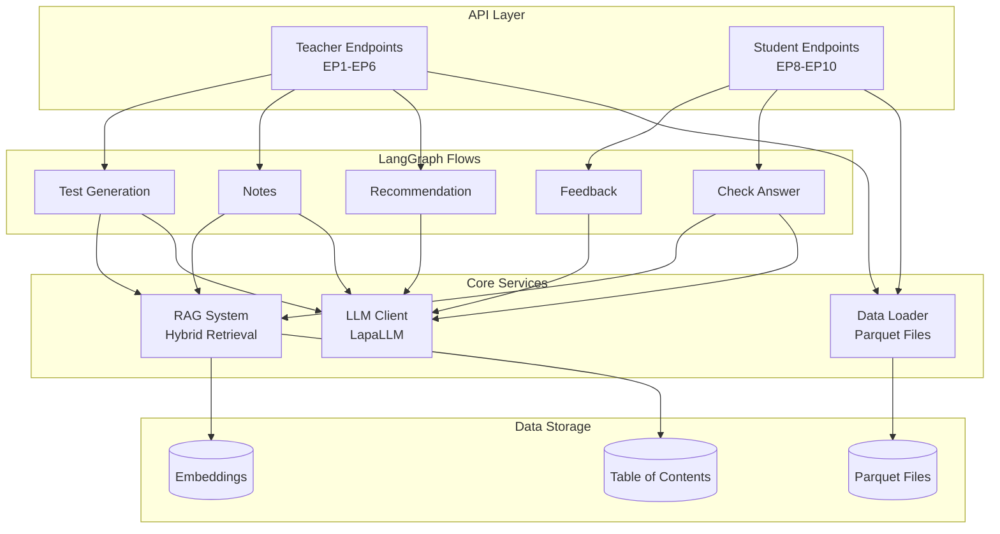
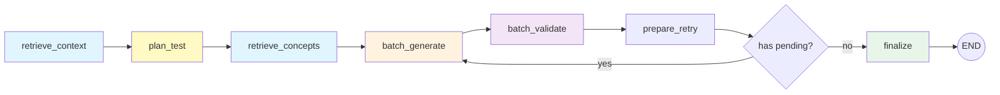
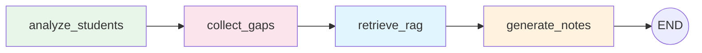
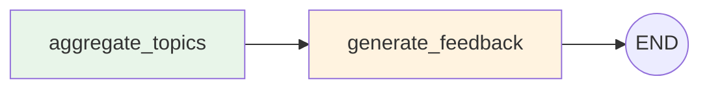
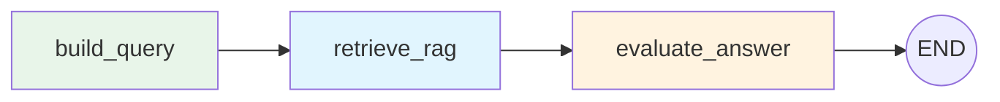
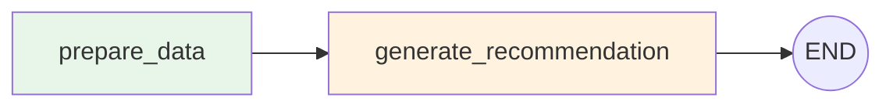
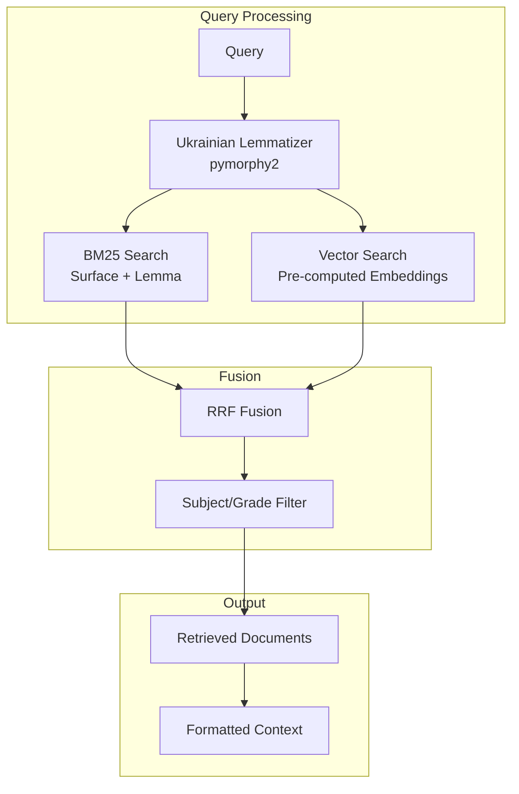

# Technical Architecture Documentation

This document describes the LangGraph flows, RAG system, and technical relationships in the backend.

---

## Table of Contents

- [System Overview](#system-overview)
- [LangGraph Flows](#langgraph-flows)
  - [Test Generation Flow (EP4)](#test-generation-flow-ep4)
  - [Notes Generation Flow (EP3)](#notes-generation-flow-ep3)
  - [Feedback Flow (EP10)](#feedback-flow-ep10)
  - [Check Answer Flow (EP9)](#check-answer-flow-ep9)
  - [Recommendation Flow (EP6)](#recommendation-flow-ep6)
- [RAG System](#rag-system)
- [Shared Components](#shared-components)
- [Data Layer](#data-layer)
- [Configuration](#configuration)
- [Key Patterns](#key-patterns)

---

## System Overview



---

## LangGraph Flows

### Test Generation Flow (EP4)

Generates validated test questions using a planning-based parallel architecture. An LLM first plans the test structure (concepts to cover, question specs), then questions are generated and validated in parallel with automatic retry for failures.



**State:** `TestGenState`

| Key Field | Type | Description |
|-----------|------|-------------|
| subject | string | Subject name |
| grade | int | Grade level (8-9) |
| topic_definition | string | Topic to generate questions for |
| easy_count, medium_count, hard_count | int | Requested question counts |
| rag_context | string | Base topic context from RAG |
| test_plan | TestPlan | LLM-generated test structure |
| concepts | list[str] | Key concepts identified by planner |
| concept_contexts | dict | Per-concept RAG contexts |
| pending_specs | list[QuestionSpec] | Queue of specs to generate |
| validated_questions | list | Final validated questions |
| failed_specs | list | Specs that failed validation |
| retry_count | int | Current retry iteration (max 2) |

**Flow Details:**

1. **retrieve_context**: RAG retrieval for base topic content (top_k=4, max_chars=6000)

2. **plan_test**: Single LLM call to design entire test structure
   - Identifies 3-5 key concepts to cover
   - Creates question specs with difficulty, type, concept, and focus
   - Smart distribution of question types based on difficulty

3. **retrieve_concepts**: Parallel RAG retrieval for each concept (5 concurrent)
   - Gets targeted context for each concept
   - More efficient than per-question retrieval

4. **batch_generate**: Parallel question generation (10 concurrent LLM calls)
   - Each spec gets concept-specific context
   - Normalizes output format (handles old/new answer formats)
   - Temperature 0.7 for creative diversity

5. **batch_validate**: Two-phase validation
   - **CPU Phase** (instant): Format checks, deduplication, field validation
   - **LLM Phase** (parallel):
     - MC questions: Support Scoring V3 (checks each option against context)
     - Open questions: Fresh RAG retrieval + answerability check

6. **prepare_retry**: Queue failed specs for retry (max 2 iterations)

7. **finalize**: Log statistics and return validated questions

**Concurrency Limits:**
- RAG retrieval: 5 concurrent
- LLM calls: 10 concurrent

**LLM Calls:** ~1 + 2N (1 planning + N generation + N validation, where N = total questions)

---

### Notes Generation Flow (EP3)

Generates lesson notes adapted to student levels with prerequisite-aware recap. Uses LLM to intelligently filter which student gaps are actual prerequisites for the topic.



**Input (Minimal):**

Only 4 fields required:
| Field | Type | Description |
|-------|------|-------------|
| student_ids | list[int] | Students to generate notes for |
| subject | string | Алгебра, Українська мова, Історія України |
| grade | int | 8 or 9 |
| topic_definition | string | Topic to teach |

**State:** `NotesState`

| Key Field | Type | Computed By |
|-----------|------|-------------|
| level | string | analyze_students (weak/medium/strong) |
| aggregated_gaps | dict | analyze_students (weak_topics + skipped_topics) |
| class_id | int | analyze_students |
| teacher_id | int | analyze_students |
| student_gaps | list[str] | collect_gaps (LLM-filtered prerequisites) |
| rag_context | string | retrieve_rag (main topic content) |
| gaps_context | string | retrieve_rag (prerequisite content) |
| rag_references | list | retrieve_rag (combined sources) |
| title | string | generate_notes |
| contents | string | generate_notes (markdown) |
| teacher_notes | string | generate_notes |

**Flow Details:**

1. **analyze_students**: Load student data from BenchmarkDataLoader
   - If level provided: use it directly (EP3.1 passes level from request)
   - If level not provided: compute from class quartiles (EP3.2)
   - Aggregate gaps (weak_topics + skipped_topics) from student records
   - Detect class_id and teacher_id from student data

2. **collect_gaps**: Use LLM to filter prerequisites
   - Collect all gaps (union of weak_topics and skipped_topics)
   - Ask LLM which gaps are actual prerequisites for the topic
   - Returns only topics necessary to understand the new topic

3. **retrieve_rag**:
   - Always retrieve main topic content (top_k=5, max_chars=6000)
   - If prerequisites exist, also retrieve prereq content (top_k=3, max_chars=3000)

4. **generate_notes**: LLM generation with combined context
   - If prerequisites exist: `## Повторення (Recap)` → `## Урок (Lesson)` structure
   - If no prerequisites: `## Урок (Lesson)` only
   - Teacher notes include recap recommendation when applicable

**Level Handling:**
- **EP3.1 (by-level)**: Level is provided by request → passed directly to flow
- **EP3.2 (individual)**: Level computed from students using class quartiles:
```
Q1, Q3 = quartiles(all_class_scores)

WEAK:   avg_score < Q1
MEDIUM: Q1 ≤ avg_score ≤ Q3
STRONG: avg_score > Q3
```

**Prerequisite Filtering (LLM-based):**
```
Input:
  Topic: "Теорема Вієта"
  Student gaps: ["Дискримінант", "Лінійні рівняння", "Функції", "Графіки"]

LLM determines which are prerequisites:
  Output: ["Дискримінант", "Лінійні рівняння"]  # Required to understand Vieta's theorem
```

**Output Structure:**
```markdown
## Повторення
[Recap of prerequisites - only if student_gaps is not empty]

## Урок
[Main lesson content adapted to student level]
```

**LLM Calls:** 2 (1 for prerequisite filtering + 1 for notes generation)

---

### Feedback Flow (EP10)

Generates constructive feedback after a test, grouped by topic. Output is concise and factual, written FOR the student but without excessive emotion or greetings.



**State:** `FeedbackState`

| Key Field | Type | Description |
|-----------|------|-------------|
| student_id | int | Student identifier |
| subject | string | Subject name |
| questions | list | Test results |
| correct_count | int | Number correct |
| total_count | int | Total questions |
| incorrect_by_topic | dict | Failed questions grouped by topic |
| correct_by_topic | dict | Passed questions grouped by topic |
| feedback | string | Generated feedback text |

**Flow Details:**

1. **aggregate_topics**: Group questions by topic/subtopic, count correct/incorrect
2. **generate_feedback**: LLM generates concise feedback

**Output Style:**
- Concise, factual (Ukrainian language)
- Written FOR the student, but without excessive emotion
- No greetings ("Привіт"), no motivational phrases ("Вірю в тебе")
- Maximum 2-3 short paragraphs

**Note:** This flow does NOT use RAG (design decision — prompts work well without it).

**LLM Calls:** 1

---

### Check Answer Flow (EP9)

Evaluates open-ended answers using RAG-grounded evaluation. The endpoint uses the LangGraph flow for consistent behavior with LangGraph Studio.



**State:** `CheckAnswerState`

| Key Field | Type | Description |
|-----------|------|-------------|
| student_id | int | Student identifier |
| subject | string | Subject name |
| grade | int | Grade level (8-9) |
| topic | string | Question topic |
| subtopics | list[str] | Subtopics |
| question | string | Question text |
| student_answer | string | Answer to evaluate |
| query | string | Built RAG query (topic + question) |
| rag_context | string | Retrieved reference content |
| is_correct | bool | Evaluation result |
| feedback | string | Constructive feedback |

**Flow Details:**

1. **build_query**: Combine topic + question into RAG query
2. **retrieve_rag**: Get reference content (top_k=4, max_chars=4000)
3. **evaluate_answer**: LLM evaluates answer against context

**LLM Calls:** 1

---

### Recommendation Flow (EP6)

Generates teacher-facing recommendations based on student performance. Output style is concise and factual (no greetings, no addressing teacher directly).



**State:** `RecommendationState`

| Key Field | Type | Description |
|-----------|------|-------------|
| average_grade | float | Student's average (0-12) |
| level | string | Performance level |
| good_topics | list[str] | Topics with score ≥ 10 |
| bad_topics | list[str] | Topics with score < 6 |
| missed_topics | list[str] | Topics from missed lessons |
| recommendation | string | Generated advice |

**Flow Details:**

1. **prepare_data**: Validate and normalize input
2. **generate_recommendation**: LLM generates professional advice

**Output Style:**
- Concise, factual (Ukrainian language)
- No greetings ("Шановний вчителю"), no goodbyes
- Maximum 2-3 short paragraphs

**Note:** This flow does NOT use RAG (design decision).

**LLM Calls:** 1

---

## RAG System

### Architecture



### Hybrid Retriever

**Location:** `app/rag/utils/hybrid_retriever.py`

**Features:**
- **Zero-LLM retrieval** using pre-computed embeddings
- **Dual-Field BM25**: Separate indices for surface text and lemmatized text
- **RRF (Reciprocal Rank Fusion)**: Combines BM25 and vector scores
- **Ukrainian morphology**: pymorphy2 for lemmatization

**Configuration (V9):**
| Parameter | Default | Description |
|-----------|---------|-------------|
| bm25_weight | 0.4 | BM25 contribution to RRF |
| vector_weight | 0.6 | Vector contribution to RRF |
| rrf_k | 60 | RRF constant |
| top_k | 5 | Documents to retrieve |

### Subject-Specific RAG Prompts

**Location:** `app/rag/prompts/`

| File | Subject | Special Handling |
|------|---------|------------------|
| algebra_rules.py | Алгебра | Full worked examples, formula emphasis |
| ukrainian_rules.py | Українська мова | Grammar rules, examples, exceptions |
| history_rules.py | Історія України | Dates, facts, context |

---

## Shared Components

### RAG Node Factory

**Location:** `app/graph/shared/rag_node.py`

Creates configurable RAG nodes for different flows:

```python
@dataclass
class RAGConfig:
    max_chars: int = 6000      # Max context length
    top_k: int = 5             # Documents to retrieve
    parallel_queries: bool = False  # Enable parallel retrieval
    include_references: bool = True  # Return source references
```

### LLM Node Factory

**Location:** `app/graph/shared/llm_node.py`

Creates LLM generation nodes:

```python
@dataclass
class LLMConfig:
    temperature: float = 0.7
    max_tokens: int = 2000
    json_output: bool = False
```

### CPU Validators

**Location:** `app/graph/shared/cpu_validators.py`

Fast validation without LLM calls:

- `validate_question_format()`: Check structure, required fields
- `validate_batch_questions()`: Format, duplicates, field validation

---

## Data Layer

### Data Loader

**Location:** `app/services/data_loader.py`

**Class:** `BenchmarkDataLoader` (singleton)

**Data Sources:**
| File | Content |
|------|---------|
| benchmark_scores.parquet | Student grades per subject/topic |
| benchmark_absences.parquet | Missed lessons with dates |

**Key Methods:**
| Method | Description |
|--------|-------------|
| get_teacher_classes(teacher_id) | Classes taught by teacher |
| get_class_students(class_id, subject, teacher_id) | Students with levels |
| get_student_details(student_id, ...) | Detailed performance data |
| aggregate_student_gaps(student_ids, ...) | Combined weak/skipped topics |

### Level Computation

**Location:** `app/services/levels.py`

Quartile-based student level assignment:

```
WEAK:   score < Q1 (25th percentile)
MEDIUM: Q1 ≤ score ≤ Q3
STRONG: score > Q3 (75th percentile)
```

---

## Configuration

### Environment Variables

**Location:** `app/config.py`

| Category | Variables |
|----------|-----------|
| App | APP_NAME, APP_VERSION, DEBUG, ENVIRONMENT |
| Data | DATA_SCORES_PATH, DATA_ABSENCES_PATH, TOC_PATH |
| LLM | LLM_PROVIDER, LLM_API_KEY, LLM_BASE_URL, LLM_MODEL |
| RAG | RAG_EMBEDDING_TYPE, RAG_TOP_K, RAG_MAX_CHARS |
| Redis | REDIS_URL, REDIS_PASSWORD |
| Tracing | PHOENIX_ENABLED, LANGSMITH_ENABLED |

### Supported Subjects

```
Алгебра | Українська мова | Історія України
```

### Supported Grades

```
8 | 9
```

---

## Key Patterns

### Lazy Initialization

All LangGraph imports and graph compilations are lazy to avoid grpcio mutex issues on macOS:

```python
_graph = None

def get_graph():
    global _graph
    if _graph is None:
        from langgraph.graph import StateGraph, END
        _graph = build_graph()
    return _graph
```

### Singleton Pattern

Data loader, LLM client, and retriever use singletons:

```python
_data_loader = None

def get_data_loader():
    global _data_loader
    if _data_loader is None:
        _data_loader = BenchmarkDataLoader()
    return _data_loader
```

### TypedDict State Management

All LangGraph flows use TypedDict for type-safe state:

```python
class FlowState(TypedDict, total=False):
    # Input fields
    subject: str

    # Intermediate fields
    rag_context: str

    # Output fields
    result: str

    # Metadata
    llm_calls_count: int
    error_message: Optional[str]
```

### Error Handling with Fallbacks

JSON parsing with multiple strategies:

```python
def parse_json_response(response, fallback, context):
    # 1. Try direct parse
    # 2. Strip markdown code blocks
    # 3. Regex field extraction
    # 4. Return fallback
```

---

## File Structure

```
backend/
├── app/
│   ├── api/v1/           # HTTP endpoints
│   │   ├── router.py     # Main router
│   │   ├── teacher.py    # EP1-EP6
│   │   ├── student.py    # EP8-EP10
│   │   └── health.py     # Health checks
│   │
│   ├── graph/            # LangGraph workflows
│   │   ├── flows/        # Individual flows
│   │   │   ├── test_gen.py
│   │   │   ├── notes.py
│   │   │   ├── feedback.py
│   │   │   ├── check_answer.py
│   │   │   └── recommendation.py
│   │   └── shared/       # Reusable components
│   │       ├── rag_node.py
│   │       ├── llm_node.py
│   │       └── cpu_validators.py
│   │
│   ├── rag/              # RAG system
│   │   ├── utils/        # Core utilities
│   │   │   ├── hybrid_retriever.py
│   │   │   ├── llm_client.py
│   │   │   └── topic_retriever.py
│   │   └── prompts/      # Subject-specific prompts
│   │
│   ├── models/           # Pydantic models
│   │   ├── domain.py     # Core business objects
│   │   ├── requests.py   # API input
│   │   ├── responses.py  # API output
│   │   └── enums.py      # Level, Difficulty, QuestionType
│   │
│   ├── services/         # Business logic
│   │   ├── data_loader.py
│   │   ├── levels.py
│   │   └── tracing.py
│   │
│   ├── prompts/          # LLM prompt templates
│   └── utils/            # Helpers
│
├── data/                 # Runtime data
│   ├── benchmark_scores.parquet
│   ├── benchmark_absences.parquet
│   ├── toc/
│   ├── pages/
│   └── embeddings/
│
└── docs/                 # Documentation
```